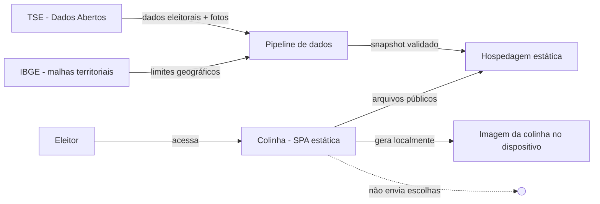
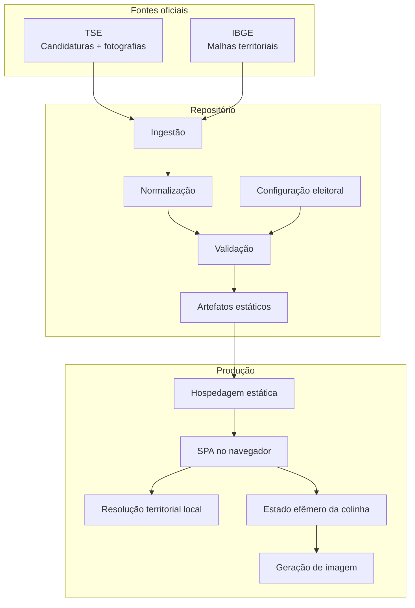
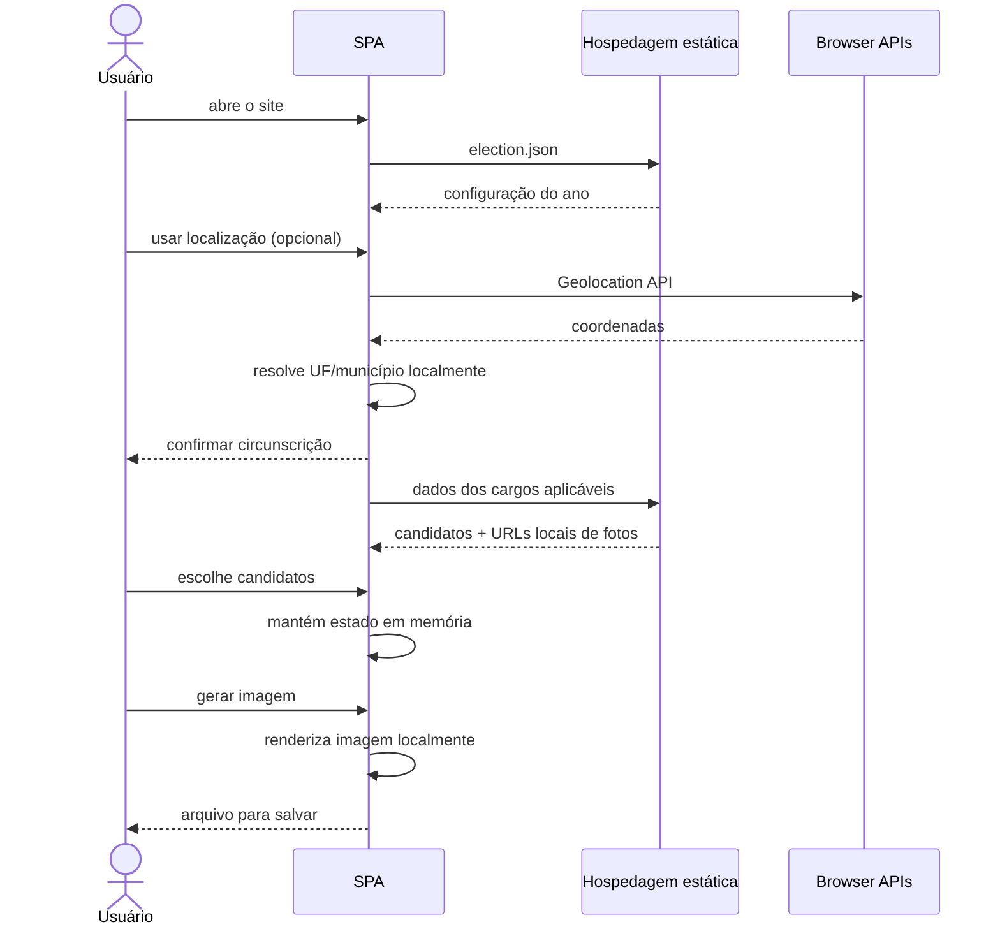
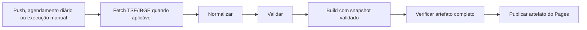

# 03 — Arquitetura

## 1. Objetivo arquitetural

Construir uma aplicação cujo funcionamento principal possa ser entregue como arquivos estáticos e cujo servidor não precise receber intenção de voto, localização eleitoral selecionada ou imagem final.

## 2. Visão de contexto



O fluxo de dados é assimétrico: o projeto publica dados públicos para o navegador; as escolhas privadas não precisam retornar à infraestrutura.

## 3. Containers lógicos



## 4. Componentes

### 4.1 SPA

Responsável por:

- ler a configuração eleitoral;
- solicitar a circunscrição mínima;
- carregar índices de candidatos;
- executar busca local;
- manter a seleção em memória;
- montar preview;
- gerar imagem.

A SPA não possui necessidade funcional de backend de negócio.

### 4.2 Configuração eleitoral

Arquivo versionado que descreve cada eleição suportada. Exemplo conceitual:

```json
{
  "year": 2026,
  "type": "GENERAL",
  "locationScope": "STATE",
  "offices": [
    { "id": "FEDERAL_DEPUTY", "choices": 1, "order": 1 },
    { "id": "STATE_OR_DISTRICT_DEPUTY", "choices": 1, "order": 2 },
    { "id": "SENATOR", "choices": 2, "order": 3 },
    { "id": "GOVERNOR", "choices": 1, "order": 4 },
    { "id": "PRESIDENT", "choices": 1, "order": 5 }
  ]
}
```

A estrutura concreta pode diferir, mas a regra é: o frontend não deve espalhar lógica eleitoral hardcoded por componentes de UI.

### 4.3 Pipeline de dados

Executado fora do caminho crítico do visitante.

Responsabilidades:

1. baixar recursos oficiais;
2. verificar integridade e formato esperado;
3. transformar o modelo externo no modelo interno;
4. filtrar apenas os campos necessários;
5. copiar/otimizar fotografias sem alterar seu conteúdo semântico;
6. gerar arquivos por eleição/circunscrição/cargo;
7. validar consistência;
8. publicar apenas snapshot aprovado.

Para 2026, o TSE informa frequência de atualização diária do conjunto de candidatos. O pipeline deve acompanhar essa cadência no período eleitoral.

### 4.4 Dados estáticos

Estrutura sugerida:

```text
public/data/
└── 2026/
    ├── election.json
    ├── metadata.json
    ├── BR/
    │   └── president/
    │       ├── candidates.json
    │       └── photos/
    ├── MA/
    │   ├── federal-deputy/
    │   ├── state-deputy/
    │   ├── senator/
    │   └── governor/
    └── ...
```

A divisão final deve equilibrar quantidade de requests, cache e tamanho dos arquivos. Fotografias devem ser carregadas sob demanda (`loading="lazy"` ou estratégia equivalente), e listas grandes de deputados não devem obrigar o download de todas as imagens antes da interação.

### 4.5 Resolução territorial local

A Geolocation API fornece coordenadas, não UF/município. Para não enviar coordenadas a terceiros, o projeto deve fazer **point-in-polygon local**.

Estratégia recomendada:

1. incluir uma malha simplificada das UFs derivada de fonte oficial do IBGE;
2. se o pleito exigir somente UF, resolver a coordenada contra essa malha;
3. se exigir município, resolver primeiro a UF;
4. carregar sob demanda a malha simplificada dos municípios daquela UF;
5. resolver o município localmente;
6. apresentar o resultado para confirmação do usuário.

As malhas oficiais do IBGE são fonte adequada para derivar esses artefatos. A versão de origem e o processo de simplificação devem ser rastreáveis.

Para 2026, `public/geography/ibge-uf-minimum.json` contém as 27 geometrias retornadas pelo serviço oficial de Malhas Geográficas do IBGE na qualidade mínima. O arquivo tem proveniência e hash da resposta original, é servido pela mesma origem da SPA e só é carregado após a pessoa acionar a geolocalização. O resolvedor point-in-polygon aceita `Polygon` e `MultiPolygon`, podendo ser reutilizado futuramente com uma partição municipal sem introduzir essa malha maior no fluxo de 2026.

## 5. Caminho do visitante



Nenhuma seta de “escolhas” retorna à hospedagem.

## 6. Estratégia de cache

Como os arquivos são públicos e versionáveis, cache é desejável para desempenho. Porém, a aplicação deve evitar cache indefinido de um snapshot sem mecanismo de atualização.

Uma abordagem segura:

- nomes de artefato com hash ou versionamento de build;
- `metadata.json` com versão do snapshot;
- arquivos de candidato cacheáveis por longo período quando content-addressed;
- manifesto/configuração com cache curto ou invalidação por deploy.

## 7. CI/CD

Pipeline sugerido:



O código do pipeline, seus mapeamentos e testes são versionados. O snapshot oficial de 2026 é gerado no runner, permanece fora do Git e entra apenas no artefato final do Pages. Nenhuma etapa de geração cria commit ou PR. Se download, interpretação, validação, build ou verificação do artefato falhar, as etapas de upload e publicação não são executadas e o último deploy válido permanece disponível.

## 8. Dependências externas em runtime

Idealmente, nenhuma dependência remota de terceiros é necessária no runtime além da própria hospedagem dos artefatos do projeto.

Evitar:

- scripts por CDN;
- fontes externas indispensáveis;
- serviços de geocodificação;
- analytics;
- pixels;
- widgets de redes sociais.

Dependências JavaScript utilizadas no bundle devem ser fixadas por versão e auditadas no pipeline.

## 9. Tecnologias da aplicação

A SPA mantém as regras eleitorais e os adaptadores de dados fora da camada de interface. A renderização declarativa usa Preact, escolhido pelo bundle pequeno e pela integração direta com TypeScript e Vite:

- TypeScript;
- Preact para componentes e estado exclusivamente em memória;
- Vite;
- HTML/CSS;
- Canvas nativo para renderização/exportação de imagem;
- Vitest para domínio, normalização e componentes;
- Playwright para fluxos em Chromium e WebKit e regressão visual por plataforma;
- GitHub Actions para pipeline e deploy;
- hospedagem estática, como GitHub Pages.

## 10. Restrições arquiteturais

Qualquer proposta que introduza um servidor que receba escolhas, tracking, persistência de intenção de voto ou geocodificação remota conflita com princípios centrais e exige ADR explícito antes de implementação.
