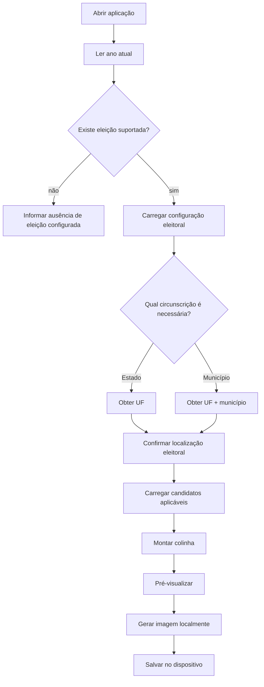
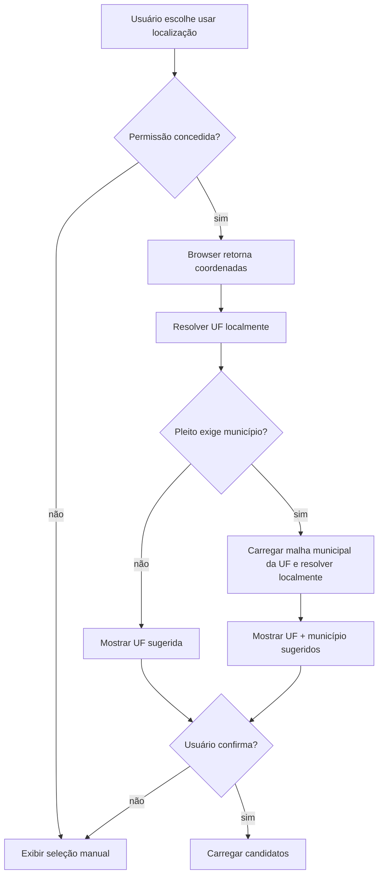
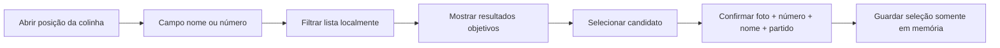
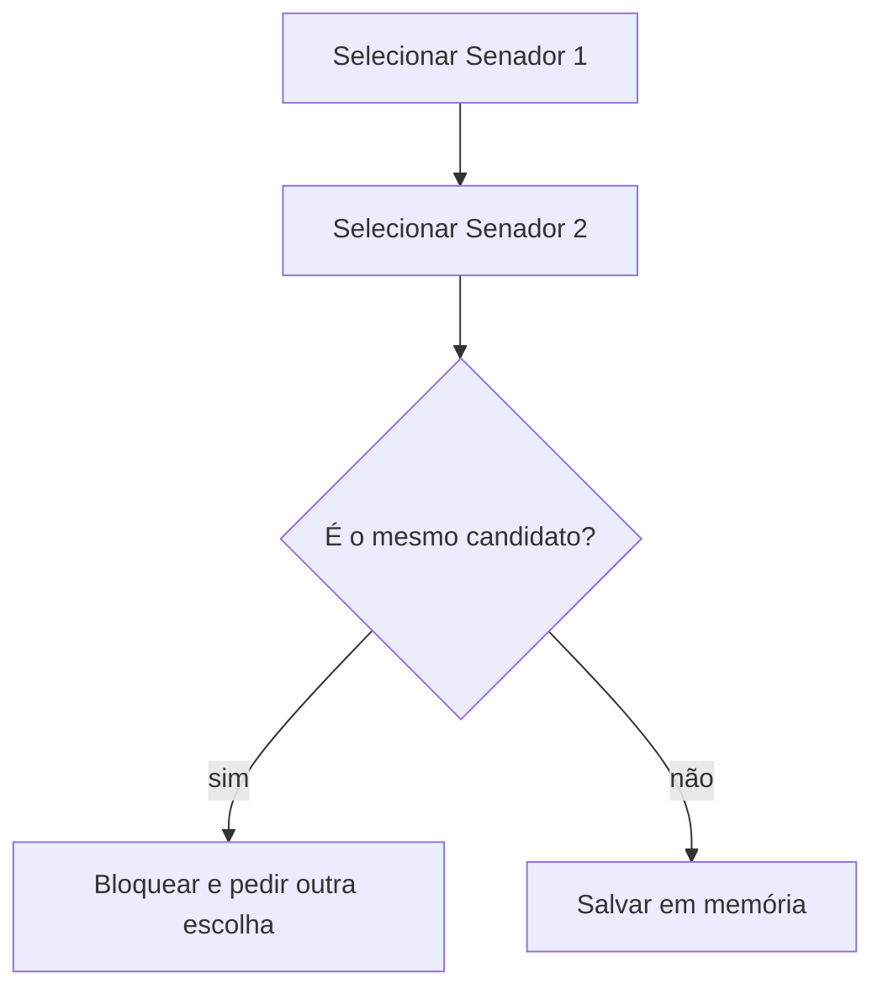
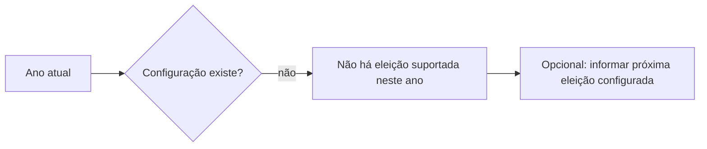

# 05 — Fluxos

## 1. Fluxo principal

## 2. Entrada territorial manual

### Eleição estadual/nacional

1. aplicação informa o pleito;
2. usuário escolhe UF;
3. aplicação confirma a UF;
4. carrega cargos estaduais daquela UF e cargos nacionais.

### Eleição municipal

1. aplicação informa o pleito;
2. usuário escolhe UF;
3. lista de municípios é limitada à UF;
4. usuário escolhe município;
5. aplicação confirma UF + município;
6. carrega candidaturas daquela circunscrição.

## 3. Entrada por geolocalização

A geolocalização nunca deve impedir o caminho manual.

## 4. Busca e seleção de candidato

A busca ignora caixa e acentos. Cada termo textual precisa ser prefixo de alguma palavra do nome de urna; a consulta numérica precisa ser prefixo do número eleitoral. No desktop, um picker flutuante usa a Popover API quando disponível e um fallback CSS com Escape, clique externo e restauração de foco nos demais navegadores. Em telas estreitas ou com ponteiro coarse, o mesmo componente ocupa `100dvh` e mantém a lista em uma área rolável própria. Partido e busca filtram juntos a lista completa, contínua e ordenada numericamente, sem paginação de apresentação ou “Mostrar mais”.

Além de candidatura, a interface do slot aceita voto em branco. Nos cargos proporcionais de 2026 — Deputado Federal e Deputado Estadual ou Distrital — também aceita legenda extraída dos próprios candidatos carregados. O modelo de domínio preserva o suporte explícito a voto nulo para compatibilidade e composição, mas essa opção não é oferecida pela interface.

## 5. Fluxo específico de 2026

Após confirmação da UF:

1. Deputado Federal;
2. Deputado Estadual ou, no DF, Deputado Distrital;
3. Senador — 1ª vaga;
4. Senador — 2ª vaga;
5. Governador;
6. Presidente.

Os cargos podem ser apresentados em uma única página longa ou em etapas, desde que a ordem seja preservada e a pessoa consiga revisar tudo antes da exportação.

## 6. Regra dos dois senadores

## 7. Geração da imagem

1. usuário abre a revisão;
2. aplicação ordena os slots conforme a configuração eleitoral;
3. para cada slot preenchido, compõe candidatura, legenda, branco ou nulo conforme o tipo explícito da escolha;
4. a partir de uma escolha, posições não preenchidas permanecem marcadas como `Não preenchido`, salvo quando o usuário ativa a opção de gerar a imagem somente com escolhas preenchidas;
5. composição é renderizada localmente;
6. um único comando gera e inicia o download; um link manual aparece somente se o navegador bloquear esse início;
7. nenhuma requisição com o conteúdo da colinha é feita.

Quando Web Share com arquivos está disponível, a mesma composição vira um `File` PNG mantido somente em memória. Depois de preparada, uma segunda ação explícita abre imediatamente o menu nativo, respeitando a ativação exigida pelo navegador. Sem suporte, o usuário baixa o arquivo; cancelamento do menu não é tratado como falha.

## 8. Alteração da circunscrição

Se o usuário trocar a UF ou município depois de selecionar candidatos:

- escolhas incompatíveis com a nova circunscrição devem ser removidas;
- escolhas nacionais que permaneçam válidas podem ser preservadas somente se isso não introduzir ambiguidade;
- a interface deve avisar claramente antes de descartar escolhas.

Para uma v1 simples, é aceitável limpar toda a colinha ao trocar a circunscrição, desde que o usuário seja avisado antes.

## 9. Erro de dados

### Snapshot indisponível

Mostrar erro e não tentar consultar uma fonte não auditada como fallback.

### Cargo sem arquivo válido

Não apresentar candidatos de outro cargo ou outra UF. Informar indisponibilidade daquele dado.

### Foto não encontrada

Exibir placeholder neutro e informar que a foto oficial não está disponível. Nome e número permanecem utilizáveis.

### Atualização em andamento

O visitante deve continuar vendo o último snapshot integral validado; não deve receber estado parcialmente atualizado.

## 10. Ano sem eleição suportada

A aplicação não deve simular automaticamente uma eleição futura ainda não confirmada.
