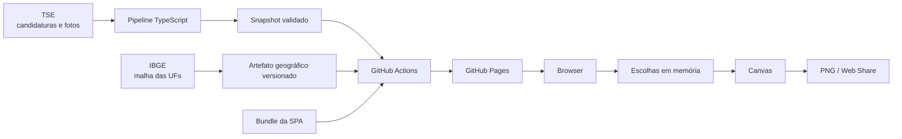
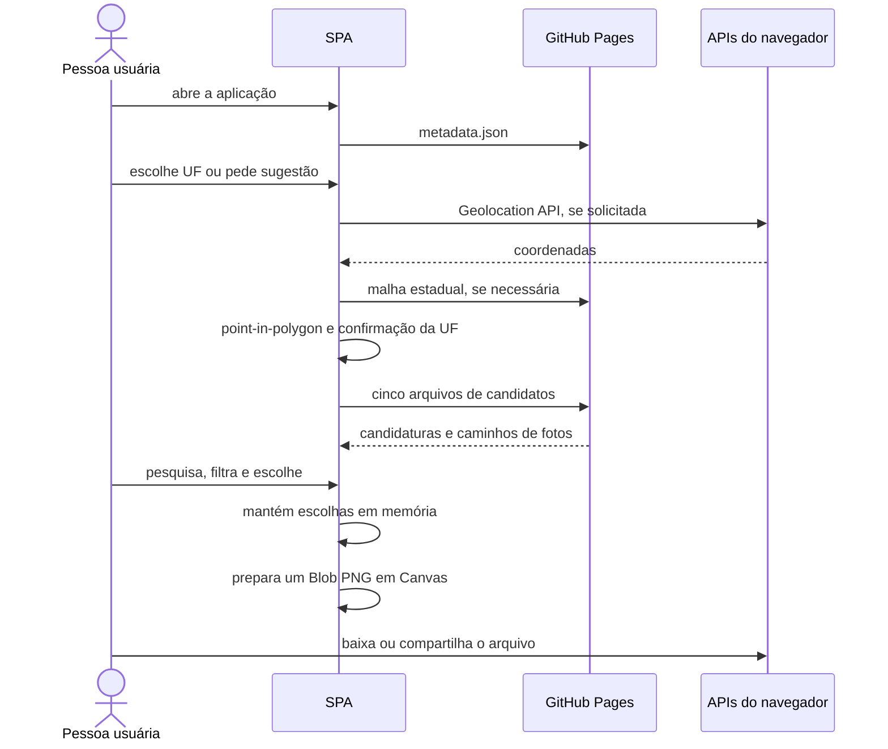
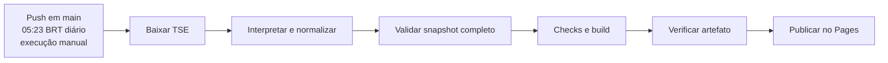

# Arquitetura

## 1. Objetivo

A Minha Colinha é uma SPA estática em que o servidor distribui apenas código e dados públicos. Seleções eleitorais permanecem no navegador e a imagem final é renderizada localmente. Não existe backend de negócio, conta de usuário ou banco de colinhas.

## 2. Visão geral



O fluxo é assimétrico: TSE, IBGE e o projeto publicam dados para o navegador; a aplicação não envia de volta a composição da colinha.

## 3. Componentes do repositório

- `src/election/` declara a eleição de 2026, cargos, ordem, quantidade de escolhas e exceção do Distrito Federal.
- `src/candidates/` define contratos, valida arquivos, carrega as partições necessárias e aplica disponibilidade e busca.
- `src/selection/` mantém e valida escolhas em memória.
- `src/colinha/` compõe o modelo de exportação e renderiza o PNG com Canvas.
- `src/location/` resolve coordenadas contra a malha estadual no navegador.
- `src/ui/` apresenta localização, seleção, revisão, download e compartilhamento.
- `scripts/tse/` baixa, interpreta, normaliza, valida e publica o snapshot oficial em staging.
- `scripts/geography/` reproduz o artefato estadual derivado do IBGE.
- `.github/workflows/deploy-pages.yml` executa pipeline, checks, build, verificação e deploy.

As regras eleitorais e os adaptadores de dados ficam fora dos componentes visuais. A configuração de 2026 é TypeScript versionado e entra no bundle; não existe um `election.json` em runtime.

## 4. Contratos de dados

### 4.1 Configuração eleitoral

`ELECTION_2026` declara o primeiro turno de 4 de outubro, a data de um eventual segundo turno sem cargos inferidos, os cinco cargos-base, duas escolhas distintas para Senador e a substituição de Deputado Estadual por Deputado Distrital no DF. Somente o primeiro turno possui posições configuradas e é apresentado pela aplicação.

Ao abrir a página, `electionForYear` seleciona uma configuração pelo ano civil. Se o ano não estiver configurado, a interface exibe o estado de eleição não suportada.

### 4.2 Candidatura

O contrato normalizado consumido pela SPA contém:

```ts
interface Candidate {
  id: string;
  electionYear: number;
  office: ElectoralOffice;
  number: string;
  ballotName: string;
  party: string;
  photoPath: string | null;
  status: "DISPLAYABLE" | "NOT_DISPLAYABLE" | "PENDING_OR_AMBIGUOUS";
  jurisdiction: ElectoralLocation;
}
```

Cada `candidates.json` inclui `schemaVersion`, natureza do dataset, aviso, ano, cargo, partição e lista de candidaturas. Texto da fonte é tratado como texto; a SPA não depende dos nomes de coluna do CSV do TSE.

Os arquivos de produção seguem a estrutura concreta:

```text
public/data/2026/
├── metadata.json
├── BR/president/candidates.json
├── BR/president/photos/*.jpg
└── <UF>/<cargo>/
    ├── candidates.json
    └── photos/*.jpg
```

Há 109 combinações esperadas de partição e cargo. Presidente usa `BR`; Deputado Federal, Senador e Governador usam as 27 UFs; Deputado Estadual usa 26 UFs e Deputado Distrital somente o DF.

### 4.3 Metadados

`metadata.json` registra provedor, conjunto, URL de origem, `sourceGeneratedAt`, `importedAt`, versão do pipeline, recursos, hashes, tamanhos, cabeçalhos observados e contagens. `sourceGeneratedAt` representa a geração dos arquivos necessários pelo TSE; `importedAt` representa a execução do projeto. A interface e o PNG usam a primeira para comunicar frescor da fonte.

### 4.4 Escolhas

Uma escolha é uma união explícita de candidatura, legenda, branco ou nulo. Ela vive em `SelectionSession`, indexada pelo identificador do slot. `SENATOR:1` e `SENATOR:2` são posições diferentes, e o domínio impede o mesmo `candidateId` nas duas.

O estado não é serializado em `localStorage`, `sessionStorage`, IndexedDB, cookies, URL ou servidor. Alterar a UF após confirmação destrutiva inicia uma sessão compatível com a nova circunscrição.

## 5. Fluxo no navegador



Para uma UF confirmada, o carregamento em lote solicita quatro arquivos estaduais e Presidente em `BR`. A busca por prefixo de palavras ou número e o filtro de partido operam sobre esses dados no cliente. No desktop, o picker é uma superfície fixa ancorada ao gatilho por geometria calculada; no mobile/touch, ocupa o viewport e mantém resultados em uma região rolável.

## 6. Exportação

Após a primeira escolha, cada alteração invalida a versão preparada. Uma espera curta evita recomposições desnecessárias; depois dela, a aplicação cria um único `Blob` PNG em memória. Download e Web Share reutilizam esse objeto. O compartilhamento só é habilitado quando o navegador informa suporte a arquivos; caso contrário, o download permanece disponível.

O modelo de exportação preserva a ordem oficial, representa posições vazias, aceita a opção de omiti-las e usa placeholders para fotos ausentes. A legenda de frescor informa a data de geração dos dados na fonte, não a hora de importação pelo projeto.

## 7. Geolocalização

`public/geography/ibge-uf-minimum.json` contém as 27 geometrias estaduais obtidas do serviço oficial de Malhas Geográficas do IBGE em qualidade mínima. O arquivo registra URL, instante de obtenção e SHA-256 da resposta original.

A malha só é solicitada depois da ação “Usar minha localização”. Latitude e longitude existem apenas durante a operação assíncrona de resolução local; o estado público recebe somente a UF sugerida. A pessoa confirma ou corrige essa sugestão antes do carregamento eleitoral, e qualquer falha mantém disponível a escolha manual.

## 8. Pipeline e publicação



O snapshot volumoso é gerado no runner e não é versionado. Downloads e extrações ficam em diretório temporário; a escrita ocorre em staging e a troca do destino é atômica. O workflow confirma metadados, 109 arquivos de candidatos, fotografias, malha geográfica, atribuições e ausência das fixtures no `dist` antes do deploy. Uma falha interrompe a publicação e preserva o último deploy válido.

Detalhes de campos, códigos, formatos, associação de fotos e falhas estão no [pipeline de dados do TSE](tse-data-pipeline.md).

## 9. Tecnologias e dependências

Preact renderiza a interface e mantém estado local; TypeScript explicita contratos; Vite produz os arquivos estáticos; Canvas e APIs nativas entregam o PNG; Vitest cobre domínio e DOM; Playwright cobre fluxos em Chromium e WebKit. Dependências são fixadas pelo lockfile. O runtime não carrega scripts, fontes, analytics ou serviços de geocodificação de terceiros.

## 10. Restrições

As garantias centrais dependem de manter a arquitetura estática, escolhas em memória, geração local e fontes auditáveis. Persistência de intenção de voto, tracking, geocodificação remota ou um servidor que receba escolhas alterariam o modelo de confiança e exigiriam uma nova decisão arquitetural explícita.
