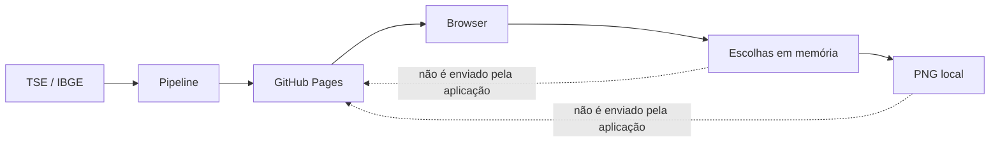

# Modelo de privacidade e confiança

## 1. Objetivo

A composição de uma colinha pode revelar intenção de voto. O objetivo central é tornar desnecessário que a infraestrutura da Minha Colinha receba ou persista essa informação. A garantia principal vem da arquitetura estática e do processamento local, não de uma promessa absoluta sobre toda a infraestrutura da internet.

## 2. Modelo de confiança

A pessoa precisa confiar no código e no artefato publicados, no pipeline que transforma as fontes oficiais e no navegador/dispositivo em que executa a aplicação. TSE e IBGE são as fontes dos dados públicos; GitHub Actions constrói o artefato; GitHub Pages e sua CDN o distribuem.

O projeto não opera backend de negócio, conta, banco de colinhas, analytics ou endpoint de seleção. GitHub Pages e intermediários de rede ainda podem processar logs técnicos de acesso. Um dispositivo, navegador ou extensão comprometidos também estão fora da capacidade de proteção da aplicação.

## 3. Dados tratados

| Dado | Uso | Persistência pela aplicação | Rede |
| --- | --- | --- | --- |
| Ano do dispositivo | Selecionar a configuração 2026 | Não | Não |
| UF confirmada | Carregar cargos estaduais | Somente memória | O path dos arquivos pode torná-la inferível |
| Coordenadas | Sugerir a UF, se solicitado | Não; usadas durante a resolução | Não são acrescentadas a requests nem enviadas a geocodificador |
| Termos e filtros | Buscar candidaturas locais | Somente memória | Não |
| Escolhas | Compor revisão e PNG | Somente memória | Não como payload ou telemetria |
| Imagem final | Download ou Web Share | Não pela aplicação | Entregue à ação local escolhida pela pessoa |
| Nome, CPF, título, e-mail ou telefone | Nenhum | Não solicitado | Não |

Os dados públicos de candidaturas e fotos são baixados do próprio site conforme a UF, o cargo, os resultados visíveis e o comportamento de lazy loading do navegador.

## 4. Fronteira de privacidade

“As escolhas não são enviadas pela aplicação” significa que não existe request, URL, cookie, armazenamento ou evento analítico contendo a composição. Não significa que o provedor de hospedagem desconheça o IP, horário, user agent ou caminhos públicos solicitados.

## 5. Geolocalização local

A escolha manual de UF é o fluxo principal. “Usar minha localização” solicita a Geolocation API somente após clique. Em seguida, o navegador baixa `geography/ibge-uf-minimum.json` da própria origem e executa point-in-polygon sobre as 27 geometrias estaduais.

Latitude e longitude ficam em variáveis da operação assíncrona e não são copiadas para o estado público. O resultado é apenas uma UF sugerida, que precisa de confirmação. Negação, timeout, ausência da API, ponto fora da malha ou erro de arquivo devolvem controle ao formulário manual. Não há reverse geocoding remoto ou localização por IP na aplicação.

## 6. Requisições estáticas e fotografias

O particionamento por UF reduz o download, mas caminhos como `/data/2026/SP/...` permitem ao provedor inferir interesse por dados de São Paulo. Isso não equivale à composição da colinha, porém impede afirmar que a UF seja invisível à hospedagem.

Fotos têm arquivos próprios e são carregadas sob demanda nos resultados e nas escolhas. Logs de CDN podem revelar quais imagens o navegador solicitou e, portanto, interesse por candidaturas. Como fotos também aparecem durante navegação e busca, uma requisição isolada não é um registro confiável de seleção, mas continua sendo um sinal técnico. A aplicação não adiciona identificador próprio, evento analítico ou endpoint de confirmação.

O compartilhamento usa a interface nativa do sistema. Depois que a pessoa escolhe um destino, o tratamento do arquivo passa a depender daquele aplicativo ou serviço; essa transmissão é uma ação explícita fora da infraestrutura da Minha Colinha.

## 7. Ameaças principais

- **dados adulterados:** alteração de número, nome, situação, foto ou regra eleitoral;
- **snapshot parcial:** mistura de recursos ou publicação incompleta;
- **mudança da fonte:** schema, código ou descrição oficial não reconhecidos;
- **supply chain:** dependência, Action ou processo de build comprometido;
- **conteúdo externo malicioso:** campos do TSE tentando introduzir markup ou scripts;
- **exposição por infraestrutura:** correlação de IP, UF e arquivos/fotos solicitados;
- **persistência acidental:** inclusão futura de storage, analytics ou URLs com escolhas;
- **dispositivo comprometido:** navegador, extensão ou sistema capturando a tela ou memória.

## 8. Controles implementados

- SPA estática sem backend de negócio ou telemetria de seleção;
- escolhas e PNG mantidos somente em memória;
- geolocalização opt-in, resolução estadual local e confirmação manual;
- CSP em `<meta>` restringindo origens, scripts, objetos, imagens e formulários;
- política `no-referrer` no documento;
- dependências fixadas em `package-lock.json` e ausência de scripts runtime por CDN;
- renderização declarativa de texto externo, sem uso de `innerHTML` para campos eleitorais;
- parsers com limites e mapeamentos explícitos de cargos e situações;
- validação dos contratos no pipeline e novamente no carregamento da SPA;
- hashes e metadados de proveniência dos recursos importados;
- staging e publicação atômica do snapshot;
- workflow com permissões `contents: read`, `pages: write` e `id-token: write`, sem comandos de commit ou PR;
- deploy somente após typecheck, lint, testes, build e verificação do artefato;
- fixtures fictícias excluídas do build de produção.

## 9. Recomendações operacionais

Os itens abaixo dependem da configuração da conta ou do repositório e não são afirmados como implementados por este código:

- exigir 2FA das contas mantenedoras;
- configurar ruleset/proteção de `main` contra force push e exclusão;
- exigir revisão de mudanças sensíveis quando houver mais de um mantenedor disponível;
- acompanhar falhas e notificações do GitHub Actions durante o período eleitoral;
- revisar periodicamente permissões, dependências e Actions utilizadas;
- manter retenção e analytics da hospedagem no mínimo oferecido pelo provedor;
- considerar pin de Actions por commit conforme a política de manutenção do projeto.

## 10. Limitações

- GitHub Pages não oferece ao repositório controle completo sobre logs, retenção e todos os headers HTTP;
- a CSP em `<meta>` não substitui todas as políticas que poderiam ser enviadas por header;
- paths por UF e requests de fotos geram sinais observáveis pelo provedor;
- o projeto não protege contra dispositivo, navegador, extensão ou aplicativo de compartilhamento comprometidos;
- recarregar a página perde escolhas por decisão de privacidade;
- o último snapshot válido permanece no ar quando a atualização falha e pode ficar defasado;
- a fonte do TSE pode mudar códigos, schema, disponibilidade ou conteúdo e exigir revisão humana.

Qualquer proposta de persistir rascunhos, sincronizar dispositivos, adicionar analytics, geocodificar remotamente ou enviar a imagem a um servidor exige nova análise do modelo de confiança antes da implementação.

## 11. Divulgação responsável

O canal privado preferido, o escopo e os cuidados para reproduções com dados fictícios estão na [política de segurança](../SECURITY.md). Não publique coordenadas, colinhas reais, intenção de voto ou detalhes de exploração antes da correção.
